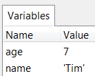
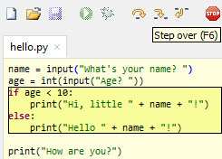
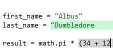
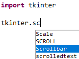
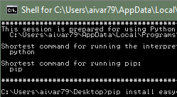
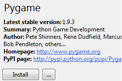

# Guía 1121: IDE

:::{list-table}
:widths: 35 65
* - ```{list-table}
    * - 
    ```
  - ```{list-table}
    :align: left
    * - **INSTITUCIÓN EDUCATIVA**: John F. Kennedy
        - **DOCENTE**: Julian Camilo Fonseca Romero
        - **ASIGNATURA**: Programación
        - **GRADO**: ONCE
        - **PERIODO**: 01
        - **TIEMPO**: 10 semanas (2 horas / semana)
        - **TIEMPO DE TRABAJO**: 20/20 horas
    ```
:::

:::{tab-set}
```{tab-item} Objetivo
{bdg-light}`Exploración`
{bdg-info}`Estructuración`
{bdg-warning}`Actividad práctica`
{bdg-danger}`Transferencia`
- **Temática**: .
- **Objetivo de aprendizaje**: .
- **DESEMPEÑO**: .
```

```{tab-item} Orientaciones curriculares
- **Componente**: .
- **Competencia**: .
- **Evidencia de aprendizaje**: .
```

```{tab-item} Criterios de evaluación
- Actividades desarrolladas en su totalidad.
- Participación en clase.
- Explicación clara de conceptos.
- Argumentación de ideas.
- Cumplimiento de las reglas del aula.
```

```{tab-item} Recursos (0)
- ok
```

:::

## Mensaje del autor

:::{pull-quote}
"".

-- Camilo Fonseca
:::

---
## ¿Qué es un IDE?
Un IDE (**entorno de desarrollo integrado**) es un software que ayuda a los programadores a desarrollar código de software de manera eficiente.

Un IDE aumenta la **productividad de los desarrolladores** al combinar capacidades como editar, crear, probar y empaquetar software en una aplicación fácil de usar.

> "Así como los escritores utilizan editores de texto y los contadores utilizan hojas de cálculo, los desarrolladores de software utilizan IDES".

---
## Características de un IDE

:::{csv-table}
:delim: ;
:header-rows: 1
Característica ; Descripción
Automatización de la edición de código ; Los lenguajes de programación tienen reglas sobre cómo estructurar instrucciones. Dado que un IDE conoce estas reglas, contiene muchas funciones inteligentes para escribir o editar automáticamente el código fuente.
Resaltado de sintaxis ; Un IDE puede dar formato al texto escrito haciendo que algunas palabras aparezcan en negritas o itálicas, o utilizando diferentes colores de fuente. Estas pistas visuales hacen que el código fuente sea más legible y previenen errores sintácticos accidentales.
Finalización de código inteligente ; Un IDE puede proponer sugerencias para completar una instrucción de código cuando el desarrollador comienza a escribir.
Refactorización del soporte ; La refactorización de código es el proceso de reestructuración del código fuente para hacerlo más eficiente y legible sin tener que cambiar su funcionalidad central.
Automatización de la creación local ; Los IDE realizan tareas de desarrollo recurrentes que por lo general son parte de todos los cambios de código. Esto aumenta la productividad.
Compilación ; Un IDE compila o convierte el código en un lenguaje simplificado que el sistema operativo puede entender. El IDE convierte un código legible para humanos en código legible para máquinas.
Pruebas ; Un IDE permite automatizar pruebas antes de integrar el software en un ambiente de producción.
Depuración ; La depuración es el proceso de corregir todos los errores o fallas revelados en las pruebas. Un IDE permite seguir el código, línea por línea, conforme se pone en marcha e inspeccionar el comportamiento del código.
:::

---
## THONNY

**Thonny** es un IDE para programar en Python. Funciona en sistemas operativos Windows, Linux y MacOS.

**Thonny** viene con **Python 3.XX** integrado, por lo que solo se necesita un instalador simple y estará listo para aprender programación. (También usted puede usar una instalación de Python separada, si es necesario). La interfaz de usuario inicial está despojada de todas las funciones que pueden distraer a los principiantes.

:::{list-table}
* - ```{figure} ./recursos/G1121/image01.png
    :width: 555
    IDE Thonny
    ```
:::

> “Un IDE como Thonny permite ejecutar un conjunto de instrucciones línea por línea de forma automatizada sin necesidad de PULSAR {kbd}`ENTER` por cada instrucción como si tocaba en la consola interactiva de PYTHON”.

---
## Características de THONNY

:::{list-table}
:widths: 35 65
* - ```{list-table}
    :align: left
    * - 
    ```
  - ```{list-table}
    :align: left
    * - **VARIABLES**: En Thonny se pueden ver las variables y sus valores sin complicaciones. Una vez que haya terminado con sus primeros códigos, seleccione **Ver** > **Variables** y observe cómo sus programas y comandos de la consola interactiva afectan las variables de Python.
    ```
:::

:::{list-table}
:widths: 35 65
* - ```{list-table}
    :align: left
    * - 
    ```
  - ```{list-table}
    :align: left
    * - **Depurador simple**: Simplemente presione {kbd}`Ctrl` + {kbd}`F5` en lugar de {kbd}`F5` y podrá ejecutar sus programas paso a paso, sin necesidad de puntos de interrupción. Presione {kbd}`F6` para un paso grande y {kbd}`F7` para un paso pequeño. Los pasos siguen la estructura del programa, no solo las líneas de código.
    ```
:::

:::{list-table}
:widths: 35 65
* - ```{list-table}
    :align: left
    * - 
    ```
  - ```{list-table}
    :align: left
    * - Thonny **resalta los errores de sintaxis.** Las comillas y los paréntesis no cerrados son los errores de sintaxis más comunes para los principiantes. El editor de Thonny hace que estos sean fáciles de detectar.
    ```
:::

:::{list-table}
:widths: 35 65
* - ```{list-table}
    :align: left
    * - 
    ```
  - ```{list-table}
    :align: left
    * - Thonny tiene **auto-completado de código**. Los estudiantes pueden explorar las API con la ayuda del completado de código.
    ```
:::

:::{list-table}
:widths: 35 65
* - ```{list-table}
    :align: left
    * - 
    ```
  - ```{list-table}
    :align: left
    * - **Interfaz de línea de comandos amigable para principiantes**. Seleccione **Herramientas** > **Abre el shell del Sistema…** de línea de comandos para instalar paquetes adicionales o aprender a manejar Python en la línea de comandos.
    ```
:::

:::{list-table}
:widths: 35 65
* - ```{list-table}
    :align: left
    * - 
    ```
  - ```{list-table}
    :align: left
    * - **Interfaz gráfica de usuario simple**. Para configurar paquetes externos seleccionar **Herramientas** > **Gestionar paquetes** para una instalación aún más fácil de paquetes de terceros. Por ejemplo para interfaces gráficas.
    ```
:::

---
## A00: Introducción (5%)
{bdg-light}`Exploración`

1. TRANSCRIBA en su cuaderno el objetivo, las orientaciones curriculares y los criterios de evaluación de la presente guía.

2. Lea el mensaje del autor.

---
## A01: Taller (10%)
{bdg-info}`Estructuración`

1. En su cuaderno responda las siguientes preguntas:

    - ¿Qué es un IDE?
    - ¿Qué tienen en común y en que se diferencian los desarrolladores de software con los escritores y los contadores?
    - ¿De qué forma se pueden ver los valores de las variables en Thonny?
    - ¿Qué es para usted depurar?
    - ¿Cuales son los **errores de sintaxis** más comunes al momento de programar?
    - ¿Por qué se considera que las **pruebas y la depuración** es lo más importante que debe incluir un IDE? 

2. Con la tabla: **Características de un IDE**, realizar un mapa conceptual.

3. Para las siguientes frases, en su cuaderno marque **falso** o **verdadero** y explique el por qué:

   - Thonny es un IDE para programar en JavaScript. **(F o V)**
   - Thonny solo funciona en sistema operativo Windows. **(F o V)**
   - Thonny solo es para usuarios avanzados. **(F o V)**
   - Thonny viene con Python integrado. Así que no es necesario instalar Python por aparte. **(F o V)**
   - Al igual que en la consola interactiva de PYTHON, en Thonny es necesario PULSAR la tecla {kbd}`ENTER` cada vez que queramos ejecutar una instrucción. **(F o V)**

4. Consulte en INTERNET los siguientes temas y haga un resumen corto en su cuaderno:

   - ¿Qué otros IDES existen para programar en Python? (Mínimo 2 IDES por cada sistema operativo LINUX, Windows y MacOS)
   - ¿Qué es una API **(Application Programming Interface)**?

---
## A02: Interfaz IDE Thonny (25%)
{bdg-warning}`Actividad práctica`

1. EJECUTE el software Thonny.

2. En el **área superior de la interfaz**, PULSE cada una de las opciones del menú superior (**File**, **Edit**, **View**, **Run**, **Tools**, **Help**). Por cada menú desplegado, en su cuaderno escriba su posible utilidad.

3. En la interfaz, UBIQUE la **barra de herramientas estándar**:

    :::{list-table}
    * - ```{figure} ./recursos/G1121/image08.png
        :width: 444
        IDE Thonny
        ```
    :::

4. SITUE el mouse en cada uno de los iconos de la **barra de herramientas estándar** para generar su **descripción**, luego dicha descripción ***escríbala en su cuaderno***.

5. En el **menú superior**, PULSE el menú **View** y active cada uno de los elementos presentes en dicho menú como son (**Files**, **Exception**, **Files**, etc.) Por cada menú activado, en su cuaderno describa los cambios en la interfaz.

    :::{list-table}
    * - ```{figure} ./recursos/G1121/image09.png
        :width: 111
        Menú de herramientas
        ```
    :::

6. Cuando termine de activar todas las herramientas, solo dejar activas las siguientes:
   
   - Assistant
   - Files
   - Shell
   - Variables

7. En la ventana **Files**, *acceda carpeta por carpeta* hasta que llegue a la **localización** de la **carpeta de evidencias**. Debería tener la siguiente interfaz:

    :::{list-table}
    * - ```{figure} ./recursos/G1121/image10.png
        :width: 666
        Interfaz IDE THONNY
        ```
    :::

8. Cierre el IDE **Thonny**.

---
## A03: Primer código (25%)
{bdg-warning}`Actividad práctica`

1. Abra el IDE Thonny.

2. En la ventana **Files** y acceda a la **carpeta de evidencias** del periodo actual.

3. Sobre el *fondo blanco* de la ventana **Files**, PULSE el {kbd}`rmb` (right mouse button) para abrir el **menú contextual**. SELECCIONE **New file…**

    :::{list-table}
    * - ```{figure} ./recursos/G1121/image11.png
        :width: 222
        ```
    :::

4. En la ventana **File name**, ESCRIBIR el nombre: **G1121A03-presentacion.py** y dar clic en {guilabel}`OK`

    :::{list-table}
    * - ```{figure} ./recursos/G1121/image12.png
        :width: 333
        ```
    :::

5. En el archivo **G1121A03-presentacion.py** escriba 3 comentarios para realizar **identificación** de su **código fuente**. Los comentarios inician con el carácter **#**.

    ```python
    # PROGRAMA: Presentación personal
    # AUTOR: Julian Fonseca
    # FECHA: 21 de agosto de 2026
    ```

    :::{admonition} ¿Por qué agregar comentarios al código?

    > Un comentario es una **sección del código** que **NO SE EJECUTA**.

    Los comentarios no solo sirven para identificar el código fuente. También sirven para lo siguiente:
    
    - **Claridad**: Aclarar secciones complejas, algoritmos o decisiones de diseño.
    - **Mantenimiento**: Facilitar la modificación y depuración del código en el futuro. Un código bien comentado es más fácil de actualizar.
    - **Colaboración**: Permitir a otros programadores entender su lógica y contribuir eficientemente.
    - **Documentación**: Servir como documentación interna del código, complementando la documentación externa.
    
    En Python para establecer un comentario, antes de la línea de código se escribe el carácter **#**.
    :::

    :::{admonition} En su cuaderno...
    :class: note
    Responda las siguientes preguntas:
    - ¿Qué problemas podrían suceder si no se agregan comentarios al código?
    - ¿Qué sucede con la ejecución de un código si todas sus líneas son comentarios?
    - En Python, ¿Cómo se establece un comentario?
    :::

6. Al código adicione unas variables que almacenen la información de presentación de una persona:

    - nombre (usar variable **tipo cadena**)
    - apellido (usar variable **tipo cadena**)
    - edad (usar variable **tipo entero**)
    - día de nacimiento (usar variable **tipo entero**)
    - mes de nacimiento (usar variable **tipo entero**)
    - año de nacimiento (usar variable **tipo entero**)
    - grado (usar variable **tipo entero**)
    - curso (usar variable **tipo carácter**)
    - deporte (usar variable **tipo cadena**)
    - hobby favorito (usar variable **tipo cadena**)

    ```python
    # EJEMPLO
    nombre = "Julian"
    apellido = "Fonseca"
    edad = 24
    ``` 

7. Ahora es necesario crear otras variables, que **almacenen los mensajes** que van a **mostrar la información de la persona**. Estas variables son también de **tipo cadena**.

    ```python
    # EJEMPLO
    mensaje01 = f"mi nombre es {nombre} {apellido}"
    mensaje02 = f"tengo {edad} años"
    ```

    :::{admonition} ¿Por qué se agrega la letra f antes de la cadena?
    Se agrega la letra **f** antes de un texto en Python para crear una **cadena formateada (f-string)**, lo que permite **insertar variables** y **operaciones matemáticas** directamente dentro de las comillas usando llaves **{}s**.
    :::

8. En el código añada la función `print()` para mostrar en consola el valor de las variables **mensaje**.

    ```python
    # EJEMPLO
    print(mensaje01)
    ```

9.  En la **barra de herramientas estándar**, PULSE el botón **Run current script** {kbd}`F5` para ejecutar su código (línea por línea) automáticamente.

10. Si todo esta bien, en la ventana **Shell** (consola interactiva de python) debería aparecer la siguiente salida (***con sus datos personales!!!***):

    :::{list-table}
    * - ```{figure} ./recursos/G1121/image13.png
        :width: 333
        ```
    :::

    :::{admonition} En su cuaderno...
    :class: note
    Una vez ejecutado el código, describa que sucede en las ventanas: **Shell**, **Variables** y **Assistant**.
    :::

11. Guarde los cambios y cierre el IDE Thonny. 