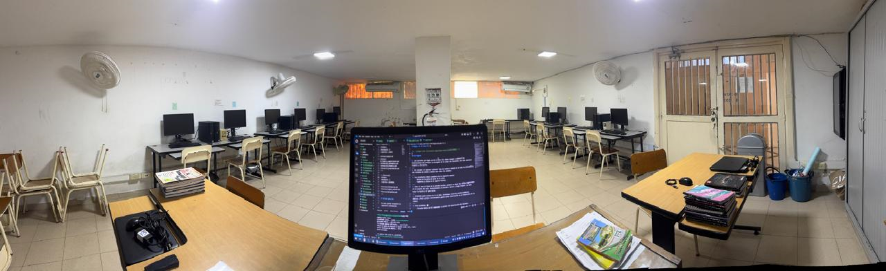

# Introducción



:::{include} ../README.md
:::

:::{list-table}
:class: none
* - ```{list-table}
    * - :::{figure} ./recursos/camilo.fonseca.png
        :width: 180
        :::
    ```
  - ```{list-table}
    * - **DOCENTE:** Julian Camilo Fonseca Romero

        **email:** camilo.fonseca@jfkennedy.edu.co

        - Ingeniero en Mecatrónica (2012)
        - Especialista en Seguridad de la Información (2015)
        - Magister en Ingeniería de Software y Sistemas Informáticos (2017)
    ```
:::

::: {admonition} PRINCIPIOS DE LA CLASE
1. "Se aprende haciendo".
2. "Se aprende enseñando".
3. "Todo se sustenta".
:::

::: {admonition} SECUENCIA DIDÁCTICA (MODELO ACTIVO)
1. {bdg-light}`Exploración`
2. {bdg-info}`Estructuración`.
3. {bdg-warning}`Actividad práctica`.
4. {bdg-danger}`Transferencia`.
:::

:::{toctree}
:hidden:
:maxdepth: 1
:caption: INTRO

0_intro/informacion.md
0_intro/reglas.md
0_intro/descargas.md
:::

:::{toctree}
:hidden:
:maxdepth: 2
:caption: Guías

1_guias/8logica/G820.md
1_guias/10informatica/G1000.md
1_guias/10ofimatica/G1010.md
1_guias/10programacion/G1020.md
:::

:::{toctree}
:maxdepth: 1
:hidden:
:caption: REFERENCIAS

2_referencias/bibliografia.md
2_referencias/webgrafia.md
:::


